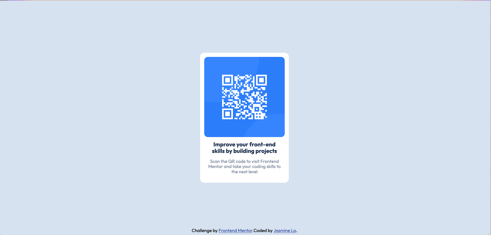

# Frontend Mentor - QR code component solution

This is a solution to the [QR code component challenge on Frontend Mentor](https://www.frontendmentor.io/challenges/qr-code-component-iux_sIO_H). Frontend Mentor challenges help you improve your coding skills by building realistic projects. 

## Overview
This challenge is to build out the QR code component and get it looking as close to the design as possible. 

### Screenshot

### Links

- Solution URL: [Github repo](https://github.com/jasmine-lmj/frontend-mentor-challenge/tree/main)
- Live Site URL: [Solution Demo](jloqrcode.netlify.app)

### Built with

- Semantic HTML5 markup
- CSS custom properties
- Flexbox
- CSS Grid
- Mobile-first workflow

## Author

- Website - [Jasmine Lo](https://jasminelo.com/)
- Frontend Mentor - [@jasmine-lmj](https://www.frontendmentor.io/profile/jasmine-lmj)
